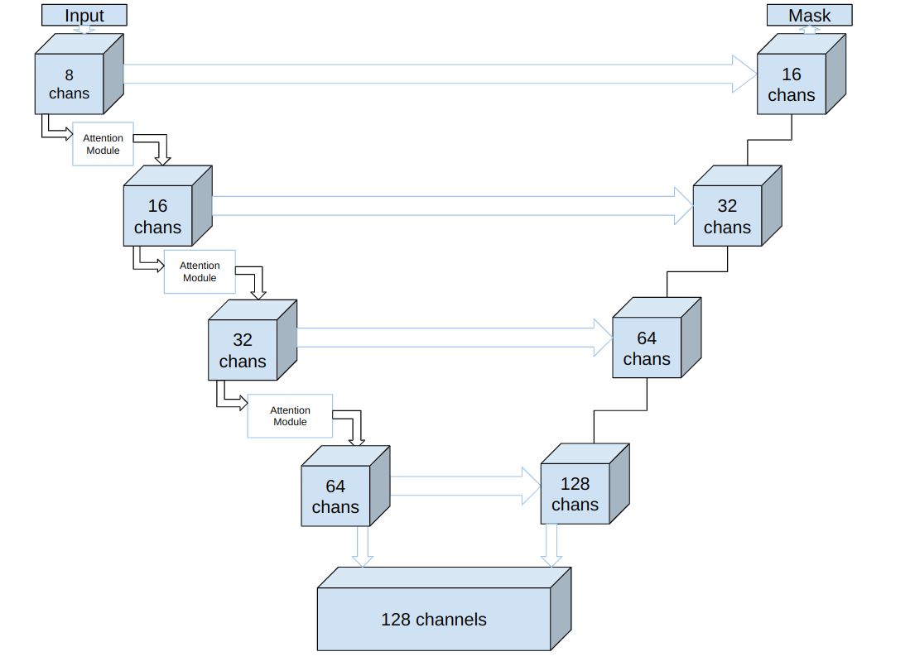

<p align="center"><b><ins> Left Atrial Segmentation </ins></b></p>

<br>

---

<br>


<br>

- Left: Ground truth
- Right: Prediction

<br>

---

<br>

- Left atrial segmentation is an important process used to evaluate the function and structure of the left atrium. 
- Late Gadolinium-enhanced magnetic resonance images (LGE-MRI) are often used for the visualization of cardiac structures, but direct segmentation of the region of interest is challenging due to the depreciated contrast in these images.

<br>

---

<br>

<ins> Train the baseline model </ins>

```
python baseline.py --root_dir ~/Drive/lasc18_dataset --batch_size 5 --max_epochs 100 --model vnetattn --lr 0.0001 --loss_criterion dice --gpu
```

<br>

<ins> Train the fine-tuning network </ins>

```
python train.py --root_dir ~/Drive/lasc18_dataset --batch_size 3 --locator_batch_size 4 --max_epochs 100 --model vnetattn --learning_rate 0.0001 --locator_learning_rate 0.0001 --loss_criterion dice --best_locator ./runs/weights/locator_vnetattn.pt --gpu
```

<br>

<ins> Test </ins>

```
python test.py --root_dir ~/Drive/lasc18_dataset --locator_path ./runs/weights/locator_vnetattn_best.pt --segmentor_path ./runs/weights/vnetattn_best.pt --gpu --output_dir ~/Drive/lasc18_dataset/test/preds/
```

<br>

<ins> Predict </ins>

```
python predict.py --root_dir ~/Drive/lasc18_dataset/test --locator_path ./runs/weights/locator_vnetattn_best.pt --segmentor_path ./runs/weights/vnetattn_best.pt --gpu --output_dir ~/Drive/lasc18_dataset/test/preds
```

<br>

<ins> Detect </ins>

```
python detect.py --raw ~/Drive/lasc18_dataset/test/raw/M2YZZ592ETSE09NBC233_lgemri.nrrd --gt ~/Drive/lasc18_dataset/test/label/M2YZZ592ETSE09NBC233_laendo.nrrd --pred ~/Drive/lasc18_dataset/preds/prediction_M2YZZ592ETSE09NBC233_lgemri.nrrd
```

<br>

---

<br>

<b><ins>Dataset </ins></b>

- [2018 Left Atrial Segmentation Challenge](http://atriaseg2018.cardiacatlas.org/)
- The original resolution of the dataset is (0.625 x 0.625 x 0.625)mm<sup>3</sup>.

<br>

---

<br>

<b><ins> Organization </ins></b>

- Code Structure

    - baseline.py $\rightarrow$ Trains the baseline network to extract approximate structure.
    - detect.py $\rightarrow$ Saves the prediction as a .gif.
    - predict.py $\rightarrow$ Makes predictions and saves the output as a .nrrd file.
    - test.py $\rightarrow$ Makes predictions and measures the metrics.
    - train.py $\rightarrow$ Trains the fine-tuning network for precise reconstruction of the atrial structure.
    - lib/augment.py $\rightarrow$ Augments the train dataset.
    - lib/data.py $\rightarrow$ Processes and Loads the data.
    - lib/losses.py $\rightarrow$ Different loss functions to optimize the neural network to.
    - lib/metrics.py $\rightarrow$ Metrics to measure the performance of the neural network.
    - lib/utils.py $\rightarrow$ Contains various utility functions.


<br>

- Dataset Structure

    - The original dataset contained 100 files for training, and 54 files for testing.
    - The test folder was left untouched.
    - The train folder was split with a 80:20 ratio, with 80 files used for training and 20 files used for validation.


<br>

---

<br>

<b><ins> Pipeline </ins></b>


<br>

- <ins>Pre-processing</ins> <br>
	- All image and mask pairs were zero-padded to have dimensions 96x640x640, so as to account for an even feature map progression through the neural network.
	- Each input image is normalized using a sample-wise normalization, where each input is subtracted with the mean intensity value and divided by the deviation of the intensity.
- <ins>Data Augmentation</ins> <br>
	- Data augmentation is a process to create new training data from existing training data. 
	- Different augmentations were applied to the images in the training set.
	- Random horizontal flip, random image rotation between -3 and 3 degrees, random image translation along either one or two axes, were the augmentation operations applied to the images in the training set to generate a total of 480 images from our original 70 images. 
	- Rotation range was limited to avoid interpolation artifacts.

<br>

---

<br>

<ins><b> Network </b></ins>

- The archutecture is a fully convolutional neural network based on VNet, but it is much lighter in terms of model parameters. 
- The original VNet model consists of 33 million parameters, while the proposed network consists of about 8 million parameters. 
- The reduction in parameters can be achieved due to the BAM’s located at each bottleneck. 
- The left part of the network is the encoder path, which extracts the features in a local-to-global sense, while the right part of the network is the decoder path, which outputs a mask with binary values for background and foreground. A high-level overview of the network can be seen in the figure below.

<br>



<br>

- Convolutions at each stage use 3D convolutional kernels with kernel size 5x5x5. 
- As the data propagates through the downsampling path, the resolution is reduced using convolutional kernels of size 2x2x2. 
- The downsampling portion of the network increases the receptive field of the features computed in the subsequent layers. 
- A deconvolution operation is performed at each stage of the upsampling in order to increase the size of the inputs. 
- This is followed by 3D convolution operations with the same parameters as in the case of downsampling. 
- The channel attention and spatial attention are calculated independently at two separate branches. 
- The final attention map is then computed by taking the sigmoid of the sum of the outputs of the channel and spatial branch.

<br>


<br>

---

<br> 

<b><ins> Evaluation </ins></b>

<br>

- The evaluation metrics used here were, dice score, IoU (Jaccard Index), Precision and Recall. 
- The Dice score is defined as:

$$
DSC = \frac{2N_{True\ Positive}}{2N_{True\ Positive} + N_{False\ Positive} + N_{False\ Negative}}
$$
<br>

- The Jaccard Index or IoU is the intersection over union of the prediction and ground truth. The IoU is useful for gauging the similarity of volumes.

$$
IoU = \frac{|A \cup B|}{|A \cap B|}
$$

<br>
- The precision is defined as the fraction of identified relevant instances.

$$
Precision = \frac{True\ Positives}{True\ Positives + False\ Positives}
$$
<br>

- The recall is defined as the percentage of correctly identified true instances.

$$
Recall = \frac{True\ Positives}{True Positives + False Positives}
$$
<br>

- These evaluation metrics are useful to gauge the performance of the model. Variation in these metrics may point to scenarios of underfitting/overfitting.

<br>

---

<br>

<b> Reference </b>

1. Xiong, Z., Xia, Q., Hu, Z., Huang, N., Bian, C., Zheng, Y., Vesal, S., Ravikumar, N., Maier, A., Yang, X. and Heng, P.A., 2021. A global benchmark of algorithms for segmenting the left atrium from late gadolinium-enhanced cardiac magnetic resonance imaging. Medical Image Analysis, 67, p.101832.
2. Xiong, Z., Fedorov, V.V., Fu, X., Cheng, E., Macleod, R. and Zhao, J., 2018. Fully automatic left atrium segmentation from late gadolinium enhanced magnetic resonance imaging using a dual fully convolutional neural network. IEEE transactions on medical imaging, 38(2), pp.515-524.
3. Milletari, F., Navab, N. and Ahmadi, S.A., 2016, October. V-net: Fully convolutional neural networks for volumetric medical image segmentation. In 2016 fourth international conference on 3D vision (3DV) (pp. 565-571). IEEE.
4. https://github.com/black0017/MedicalZooPytorch
5. https://github.com/bragancas/VNet_PyTorch-Atriaseg2018
6. https://theaisummer.com/medical-image-deep-learning/
